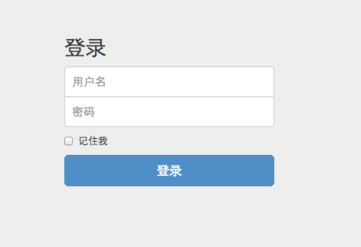
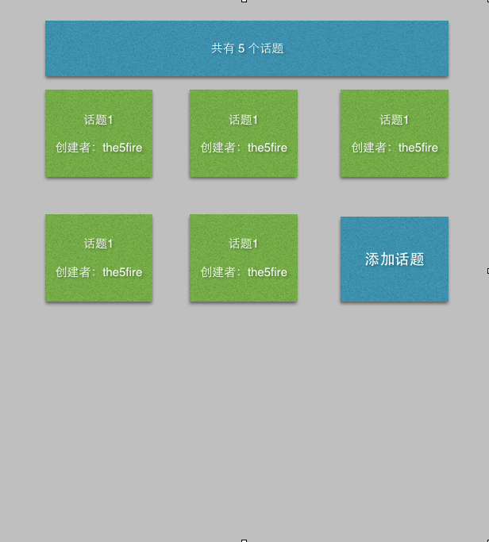
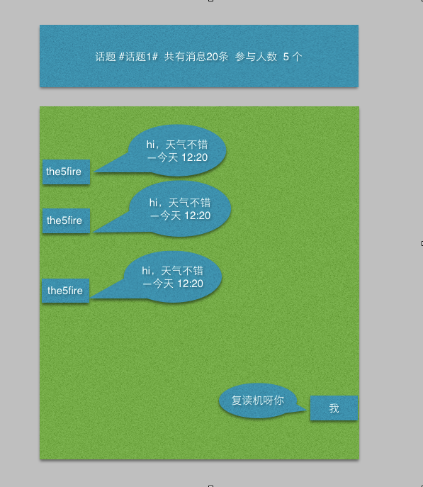

第十二章 前后端实战演练：Web聊天室-详细设计
=======================================================================

上一章简单的介绍了这个聊天室的功能和要使用的技术，这一章的主要目的是为下一章的实现做准备。
任何一个项目从需求到最后的实现，都是要经历这么个过程的，不论这个过程是否显示的存在你自己活着团队的项目历程中。拿到需求后立马开始写代码的同学要么是大牛——（对付各种需求已经有相当多的经验，在理解需求的同时已然对项目进行了分析和设计），要么就是小白——（在这个阶段，对写代码充满了激情，渴望让自己的手指在键盘上得到释放，结果大多会走偏或者自己写到混乱）。

因此需要这么个过程，对已有的需求再次思考、规划

12.1 实体(Model)设计
-------------------------
所谓的实体，就是在项目中数据存放和被传输的对象，从定义上来说就是客观存在的事物。那么在这个项目中有哪些实体存在呢？

从功能上分析，只有三个实体：用户，话题，消息。这三个实体也就是项目中的三个Model，剩下的所有业务都是围绕它们来运转的。

那么这三个实体中都应该存放什么样的数据呢？根据需求简单的列一下::

    用户(user):
        id
        username
        password
        registed_time
    话题(topic):
        id
        title
        created_time
        owner
    消息(message):
        id
        content
        topic_id
        user_id
        created_time

12.2 接口设计
--------------------
因为这个项目的重点是在前端，因此后端只是提供一个接口，先把需要的哪些接口整理清楚了，剩下的就好办了。

那么，需要哪些接口呢？

依然是根据功能来：
**用户管理**
1. 用户注册接口::
   
    /user/ [POST]
    
2. 获取用户列表接口::
   
    /user/ [GET]

3. 获取单个用户接口::

    /user/<id>/  [GET]

4. 用户登录::

   /login/ [POST]

5. 用户登出::

   /logout/ [GET]

**话题管理**
1. 话题列表::

   /topic/ [GET]
    
2. 创建话题::

   /topic/ [POST]

3. 查看具体话题(相对于进入消息列表)::

    /topic/<topic_id>/  [GET]

**消息管理**
1. 发送/回复消息::

    /message/ [POST]

2. 删除消息::

    /message/<message_id>/ [DELETE]

3. 浏览消息::

    /message/ [GET]

大体就这么些个接口，url后面表示的是HTTP的方法。

这样分析完之后，服务器的工作算是清晰了，下面在来分析页面上的工作。

12.3 页面设计
---------------------------
因为是单页应用，所有也就一个页面，但是这一个页面也是由多个视图来组成的——这里的视图可以理解为桌面程序的那种窗口。

为了有的放矢，这里我就先画几个草图，来看一下我们这个项目最终的结果可能是什么:

**登录**
这个是直接截得现成的图。

注册界面和这个一样

**话题界面**

    
**消息界面**

12.4 view的设计
--------------------------------
这里说的view，是指backbonejs中的view，按照之前的经验来说，大概需要划分的view和功能分别为：

1. 话题view(topic_view)::

    功能:
        根据话题接口获取所有话题数据，然后渲染模板

2. 消息view(message_view)::

    功能:
        根据消息接口返回的数据，渲染模板

3. 登录view(login_view)::

    功能:
        展示登录页面，发送用户数据到服务器端

4. 整体view（main_view)::

    功能：
        负责其他view的切换

12.5 总结
-------------------
这一章主要是对功能做了更进一步的处理，目的就是能够更好的开始编码。在详细设计完成之后具体实现就变得有迹可循了。

到目前为止，这个项目我也是边写边做，现在还没开始写代码。因此这篇文章的分析可能在之后还需要改动。但，即便如此，这个过程也是需要存在的，因为软件开发本身就是一个不断迭代的过程，你不可能一拍脑袋便出来一个完美方案，设计一个可行的方案，然后持续迭代才是最好的实践。

**导航**

* 上一章 11  `前后端实战演练：Web聊天室-功能分析 <11-web-chatroom-base-on-backbonejs-1.rst>`_
* 下一章 13  `前后端实战演练：Web聊天室-后端开发 <13-web-chatroom-base-on-backbonejs-3.rst>`_
